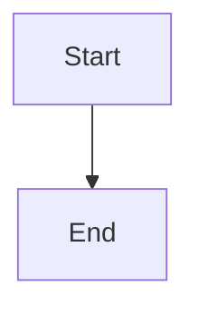

# Upstack

[](LICENSE)
[](https://github.com/memmmmike/upstack/releases)
[](https://obsidian.md)
[](https://obsidian.md)

Export your Obsidian notes to Substack-compatible HTML with one click. Automatically converts Markdown to clean, semantic HTML optimized for Substack's editor, including embedded images, Mermaid charts, callouts, and more.

## Features

### Core Functionality
- **One-Click Export**: Copy your note as Substack-ready HTML with a single click
- **Automatic Image Embedding**: Local images are automatically converted to base64 data URIs and embedded directly in the HTML
- **Substack-Optimized**: Output is clean, semantic HTML that works perfectly in Substack's editor

### Markdown Support

#### Images
- **Obsidian-style images**: `![[image.png|caption]]` → Automatically converted to base64 and embedded
- **Standard Markdown images**: `` → Converted to `<figure>` tags with captions
- **Aspect ratio containers**: Images use responsive containers to prevent layout shift
- **Excalidraw support**: Excalidraw files are detected and converted (manual upload required)

#### Diagrams & Charts
- **Mermaid charts**: Automatically converted to PNG images via mermaid.ink API
- Supports flowcharts, sequence diagrams, and all Mermaid diagram types

#### Content Formatting
- **Callouts/Admonitions**: All 8 types (note, tip, important, warning, error, success, question, info)
- **Highlights**: `==text==` → Styled `<mark>` tags
- **Footnotes**: Clickable references with footnotes section at bottom
- **Tables**: Converted to text format with separators (Substack requires Datawrapper for HTML tables)
- **Code blocks**: Styled with syntax highlighting support
- **Task lists**: Checkboxes (☐/☑) for todo items
- **Wikilinks**: `[[link]]` → Standard markdown links

#### Typography
- **Headings**: All 6 levels (H1-H6) with Substack-optimized styling
- **Text formatting**: Bold, italic, strikethrough, inline code
- **Blockquotes**: Styled quote blocks
- **Lists**: Ordered and unordered, with nested support
- **Horizontal rules**: Clean divider lines

## Installation

### From Obsidian (Recommended)

1. Open Obsidian Settings → Community Plugins
2. Disable Safe Mode
3. Click "Browse" and search for "Upstack"
4. Click "Install" then "Enable"

### Manual Installation

1. Download the latest release from [GitHub Releases](https://github.com/memmmmike/upstack/releases)
2. Extract the files to your vault's `.obsidian/plugins/upstack/` folder:
   - `main.js`
   - `manifest.json`
3. Reload Obsidian
4. Enable the plugin in Settings → Community Plugins

## Usage

### Quick Start

1. Open any Markdown note in Obsidian
2. Click the **Upstack icon** (stylized "U") in the ribbon, OR
3. Use the command palette: **"Copy current note as Substack-compatible HTML"**
4. The HTML is automatically copied to your clipboard
5. Paste directly into Substack's editor

### Example

````markdown
# My Article Title

Here's an image:
![[my-image.png|This is a caption]]

> [!tip]
> This is a helpful tip!

Here's a Mermaid chart:

````

When you copy this note, it will be converted to clean HTML with:
- The image embedded as base64
- The callout styled as a tip box
- The Mermaid chart converted to a PNG image

## Supported Features

### Fully Supported

| Feature | Obsidian Syntax | Substack Output |
|---------|----------------|-----------------|
| **Images** | `![[image.png\|caption]]` | Base64 embedded `<figure>` |
| **Mermaid Charts** | ` ```mermaid ... ``` ` | PNG image via mermaid.ink |
| **Callouts** | `> [!note]` | Styled blockquote |
| **Highlights** | `==text==` | `<mark>` tag |
| **Footnotes** | `[^1]` | Clickable superscript links |
| **Tables** | `\| Col1 \| Col2 \|` | Text format with separators |
| **Code Blocks** | ` ```code``` ` | Styled `<pre><code>` |
| **Task Lists** | `- [ ]` / `- [x]` | Checkboxes (☐/☑) |
| **Wikilinks** | `[[link]]` | Standard markdown links |
| **Headings** | `# H1` to `###### H6` | Semantic HTML headings |
| **Text Formatting** | `**bold**`, `*italic*` | Styled HTML |
| **Lists** | `- item` / `1. item` | HTML lists |
| **Blockquotes** | `> quote` | Styled blockquote |
| **Horizontal Rules** | `---` | `<hr>` tag |

## Limitations

### Current Limitations

#### Tables
- **Issue**: Substack doesn't support HTML tables directly. Tables are converted to a simple text format with vertical bar separators (`|`), which may not be ideal for complex data.
- **Workaround**: For complex tables, use [Datawrapper](https://app.datawrapper.de) to create interactive charts/tables and embed them manually in Substack.
- **Impact**: Readability of complex tables is reduced, but basic tables remain functional.

#### Excalidraw Images
- **Issue**: Excalidraw files (`.excalidraw`) are detected but cannot be automatically converted. The plugin creates a placeholder with the caption, but the image source is empty.
- **Workaround**: Manually export Excalidraw drawings as PNG/SVG and upload them to Substack, then replace the placeholder.
- **Impact**: Requires manual intervention for Excalidraw content.

#### Large Images
- **Issue**: Very large images (>1MB) converted to base64 can create extremely large HTML output (potentially 10MB+), which may:
  - Slow down Substack's editor
  - Cause browser performance issues
  - Exceed clipboard size limits
- **Workaround**: Compress images before embedding or use external image hosting.
- **Impact**: Large images may cause performance degradation or fail to copy.

#### Mermaid Charts
- **Issue**: Mermaid charts require an internet connection to convert via the `mermaid.ink` API. Charts won't render if:
  - You're offline
  - The API is down
  - Network requests are blocked
- **Workaround**: None currently - requires internet connection.
- **Impact**: Offline users cannot use Mermaid charts.

#### Base64 Image Embedding
- **Issue**: All local images are embedded as base64 data URIs, which:
  - Increases HTML size significantly (base64 is ~33% larger than binary)
  - May cause Substack's editor to lag with many images
  - Cannot be cached by browsers
- **Workaround**: Use external image hosting for better performance.
- **Impact**: Larger HTML output and potential editor performance issues.

#### Substack Editor Limitations
- **Issue**: Substack's editor may strip or modify certain HTML structures:
  - Complex nested elements
  - Custom attributes
  - Some inline styles
- **Workaround**: The plugin outputs clean, semantic HTML, but some advanced formatting may not be preserved.
- **Impact**: Some custom styling may be lost in Substack.

#### Unsupported Obsidian Features
- **Not supported**: Obsidian Canvas, embedded PDFs, embedded videos, Dataview queries (only the rendered output), and other advanced Obsidian features.
- **Impact**: These features will not be converted and may appear as broken references.

#### Performance
- **Issue**: Processing very large notes with many images can take several seconds.
- **Impact**: Brief delay when copying large notes.

## Development

### Prerequisites

- Node.js 18+ 
- npm or yarn

### Setup

```bash
# Clone the repository
git clone git@github.com:memmmmike/upstack.git
cd upstack

# Install dependencies
npm install

# Build for production
npm run build

# Build in watch mode (for development)
npm run dev
```

### Project Structure

```
upstack/
├── main.ts          # Main plugin code
├── manifest.json    # Plugin manifest
├── package.json     # Dependencies
├── tsconfig.json    # TypeScript config
├── esbuild.config.mjs  # Build configuration
└── versions.json    # Version tracking
```

## Contributing

Contributions are welcome! Please feel free to submit a Pull Request.

1. Fork the repository
2. Create your feature branch (`git checkout -b feature/AmazingFeature`)
3. Commit your changes (`git commit -m 'Add some AmazingFeature'`)
4. Push to the branch (`git push origin feature/AmazingFeature`)
5. Open a Pull Request

## License

This project is licensed under the MIT License - see the [LICENSE](LICENSE) file for details.

## Acknowledgments

- Built with [Obsidian API](https://docs.obsidian.md/)
- Uses [marked](https://github.com/markedjs/marked) for Markdown parsing
- Mermaid charts powered by [mermaid.ink](https://mermaid.ink/)

## Support

- **Issues**: [GitHub Issues](https://github.com/memmmmike/upstack/issues)
- **Discussions**: [GitHub Discussions](https://github.com/memmmmike/upstack/discussions)

## Roadmap

### Short-term (v1.1 - v1.2)
- [ ] **Image compression**: Automatically compress images before base64 conversion to reduce HTML size
- [ ] **Image size limits**: Add configurable size limits with warnings for large images
- [ ] **Performance optimization**: Optimize base64 conversion for large images (chunking improvements)
- [ ] **Better error handling**: More graceful fallbacks for failed image conversions

### Medium-term (v1.3 - v1.5)
- [ ] **Excalidraw auto-export**: Automatically export Excalidraw files to PNG before embedding
- [ ] **Offline Mermaid support**: Local Mermaid rendering using a headless browser or WASM
- [ ] **Table improvements**: Better text-based table formatting or Datawrapper integration
- [ ] **Custom styling presets**: Allow users to customize output styling (fonts, colors, spacing)
- [ ] **Progress indicators**: Show progress for large note processing

### Long-term (v2.0+)
- [ ] **Batch export**: Export multiple notes at once
- [ ] **Multi-platform support**: Export to Medium, Ghost, WordPress, and other platforms
- [ ] **Image hosting integration**: Optional integration with image hosting services (Imgur, Cloudinary, etc.)
- [ ] **Canvas support**: Convert Obsidian Canvas to images or interactive HTML
- [ ] **PDF embedding**: Support for embedded PDFs
- [ ] **Video embedding**: Support for embedded videos
- [ ] **Dataview integration**: Better support for Dataview query results
- [ ] **Template system**: Customizable HTML templates for different output styles

---

**Made with love for the Obsidian and Substack communities**
